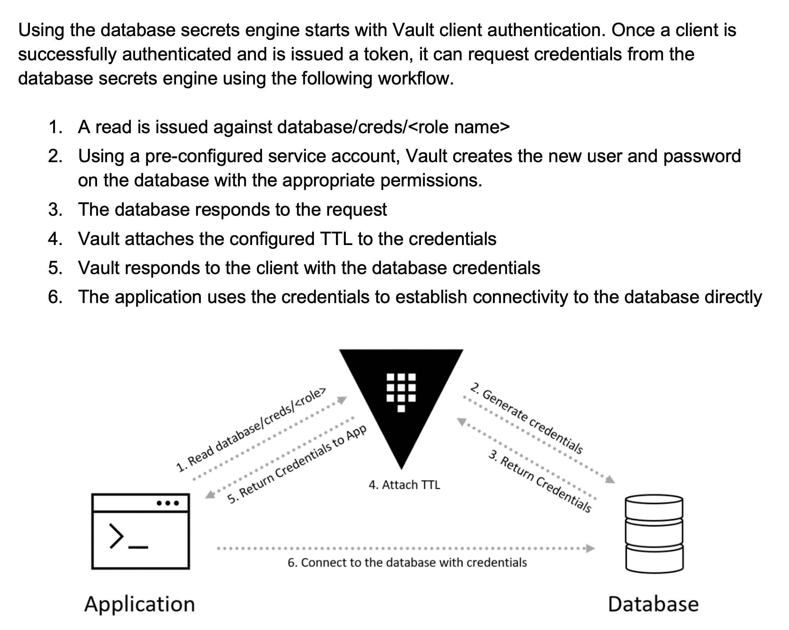

<h1><a href="#" id="main-title">Vault</a></h1>
<hr/>
<h2><a href="#" id="what_is_vault">What is Vault?</a></h2>

Vault is HashiCorp’s open-source product for managing secrets and sensitive data. 
Here’s a list of Vault’s top features that make it a popular choice for secret management:

1. Built-in concept of low trust and enforcement of security by identity
2. Encryption at rest
3. Several ways to authenticate against Vault, e.g., tokens, LDAP, AppRole, etc.
4. Policies to govern the level of access of each identity
5. Lots of secret backends, each catering to specific needs, including key-value store, Active Directory, etc.
6. Support for multiple storage backends for high availability, e.g., databases (MySQL, Postgres), object stores (GCS, S3), HashiCorp’s Consul, etc.
7. Ability to generate dynamic secrets, such as database credentials, cloud service account keys (Google, AWS, Azure), PKI certificates, etc.
8. Built-in TTL and lease for provided credentials
9. Built-in audit trail which logs every interaction with Vault
10. Several ways to interact with the Vault service, including Web UI, CLI, Rest API, and programmatic access via language libraries


<h2><a href="#" id="database_secret_engine">Database Secret Engine</a></h2>

The database secrets engine is used to generate dynamic database credentials 
against a wide variety of supported databases. The most significant benefit of 
integrating the database secrets engine with business applications is unique 
and short-lived access to the backend database that store much of their critical 
data. By adopting this strategy, applications no longer need to hardcode a generic, 
long-lived service account to access the database. Each application or node can 
now generate on-demand credentials (username and password) when access is needed, 
and Vault revokes those credentials at the end of the TTL.

Database support works using Vault's plugin system, which allows Vault to support 
many popular database platforms. Database configurations identify the plugin to be 
used to ensure Vault understands how to interact with the database appropriately. 
Many database platforms can be configured beneath a single database secrets engine. 
For example, a single database secrets engine can generate dynamic credentials for 
MySQL, MongoDB, and Oracle databases.

[]("./images/vault_database_secret_engine.png" "Database Secret Engine")

<h2><a href="#" id="configure_database_secret_engine">Configuring Database Secret Engine</a></h2>

<h3><a href="https://developer.hashicorp.com/vault/docs/secrets/databases">Enable the Secret Engine</a></h3>

The first step to using the database secrets engine is to enable it. The database 
secrets engine can be enabled using the UI, CLI, or API. To enable the database 
secrets engine at the default path using the CLI, use the command

```bash
$ vault secrets enable database
Success! Enabled the database secrets engine at: database/
```

<h3>Configure the Secrets Engine</h3>

Before creating a role, Vault needs to understand what database it will generate credentials 
against, how to connect to it, and what credentials to use to create users. This configuration 
is required for every separate database instance that Vault integrates with to generate 
credentials. For example, if an organization has separate database instances for production, 
integration, and development, each database requires a separate configuration.

```bash
vault write database/config/my-mysql-database \
    plugin_name=mysql-database-plugin \
    connection_url="{{username}}:{{password}}@tcp(127.0.0.1:3306)/" \
    allowed_roles="my-role" \
    username="vaultuser" \
    password="vaultpass"


```

<h3>Create a Role</h3>

After the database configuration has been written, one or more roles need to be defined. Each 
role specifies the database to use along with the command Vault uses to create the database user. 
The command includes some generic database platform-specific statements to create the new user 
and additional grants for the new user. For example, Vault may create a new user and only permit 
the new user SELECT, EXECUTE, and INSERT on a database named `data`. Below, shows an example of 
creating a role for the database configuration created in the section prior.

```bash
vault write database/roles/my-role \
    db_name=my-mysql-database \
    creation_statements="CREATE USER '{{name}}'@'%' IDENTIFIED BY '{{password}}';GRANT SELECT ON *.* TO '{{name}}'@'%';" \
    default_ttl="1h" \
    max_ttl="24h"
    
Success! Data written to: database/roles/my-role
```


<h3>Generate Credentials</h3>

With the prerequisites completed, an application can now generate credentials for the database. 
The credential generation is performed by issuing a read operation against the creds/ prefix 
for the role. For example, the Figure in 4-58 displays this read request for the role created above.

```bash
$ vault read database/creds/my-role
Key                Value
---                -----
lease_id           database/creds/my-role/2f6a614c-4aa2-7b19-24b9-ad944a8d4de6
lease_duration     1h
lease_renewable    true
password           yY-57n3X5UQhxnmFRP3f
username           v_vaultuser_my-role_crBWVqVh2Hc1
```


<h3>Client x509 Certificate Authentication</h3>

This plugin supports using MySQL's 
<a href="https://dev.mysql.com/doc/refman/8.0/en/using-encrypted-connections.html#using-encrypted-connections-client-side-configuration">x509 Client-side Certificate Authentication</a>

To use this authentication mechanism, configure the plugin:

```bash
$ vault write database/config/my-mysql-database \
    plugin_name=mysql-database-plugin \
    allowed_roles="my-role" \
    connection_url="user:password@tcp(localhost:3306)/test" \
    tls_certificate_key=@/path/to/client.pem \
    tls_ca=@/path/to/client.ca


```

Note: tls_certificate_key and tls_ca map to <a href="https://dev.mysql.com/doc/refman/8.0/en/connection-options.html#option_general_ssl-cert"> 
ssl-cert (combined with ssl-key)</a> and <a href="https://dev.mysql.com/doc/refman/8.0/en/connection-options.html#option_general_ssl-ca">ssl-ca </a>
configuration options from MySQL with the exception that the Vault parameters are the contents 
of those files, not filenames. As such, the two options are independent of each other. See the 
<a href="https://dev.mysql.com/doc/refman/8.0/en/connection-options.html"> MySQL Connection Options</a>for more information.

---
Examples

Using wildcards in grant statements

MySQL supports using wildcards in grant statements. These are sometimes needed by applications 
which expect access to a large number of databases inside MySQL. This can be realized by using 
a wildcard in the grant statement. For example if you want the user created by Vault to have 
access to all databases starting with fooapp_ you could use the following creation statement:

```bash
CREATE USER '{{name}}'@'%' IDENTIFIED BY '{{password}}'; GRANT SELECT ON `fooapp\_%`.* TO '{{name}}'@'%';
```

MySQL expects the part in which the wildcards are to be placed inside backticks. If you want to 
add this creation statement to Vault via the Vault CLI you cannot simply paste the above statement 
on the CLI because the shell will interpret the text between the backticks as something that must 
be executed. The easiest way to get around this is to encode the creation statement as Base64 and 
feed this to Vault. For example:

```bash
$ vault write database/roles/my-role \
    db_name=mysql \
    creation_statements="Q1JFQVRFIFVTRVIgJ3t7bmFtZX19J0AnJScgSURFTlRJRklFRCBCWSAne3twYXNzd29yZH19JzsgR1JBTlQgU0VMRUNUIE9OIGBmb29hcHBcXyVgLiogVE8gJ3t7bmFtZX19J0AnJSc7" \
    default_ttl="1h" \
    max_ttl="24h"
```


---

<h2><a href="#" id="start_in_dev_mode">Start Vault Server in Dev Mode</a></h2>

```bash
$ vault server -dev -dev-root-token-id=${VAULT_TOKEN}
```

<hr/>
<h4><a href="#" id="references">References:</a></h4>

```
McTeer, Dan, et al. Running Hashicorp Vault in Production. 1st ed., 2020. 
```
